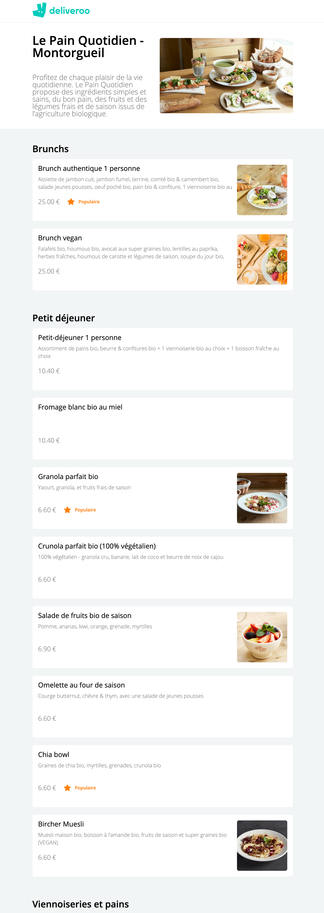
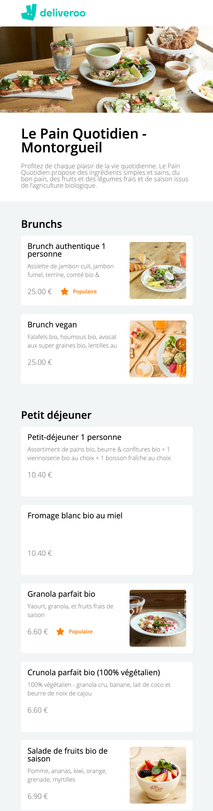

# deliveroo-backend-LeReacteur

🗓 May 2021.  
👉🏻 Look at the frontend repo!  
⇢ Backend in Node.js - Deliveroo page 🥖 Le Pain Quotidien.  
👀 Check [that](https://mydeliveroo-lereacteur-2021.netlify.app/)

## Welcome in my school exercice (Deliveroo page)

### My work?

## Languages

JavaScript & Node.js.

🙏🏻 Thank you @LeReacteur.
