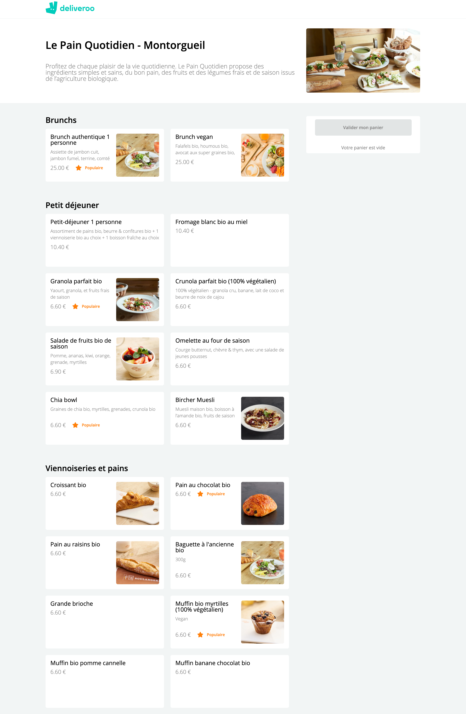
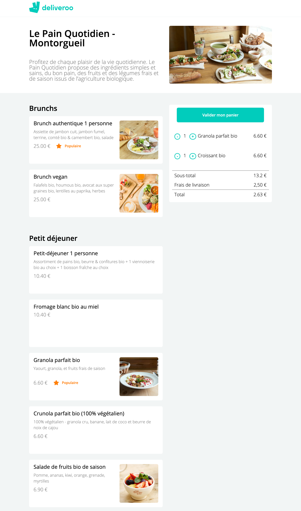
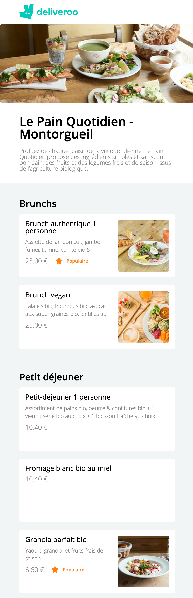

# DELIVEROO CLONE 🥐🥖

🌤 May 2021  
⚙️ Backend  
✨ Frontend - check the frontend [repo](https://github.com/manon-boiteau/deliveroo-front-LeReacteur.git)  
🔗 Netlify - check [that](https://mydeliveroo-lereacteur-2021.netlify.app/) and test to add delicious croissant in your basket

## 🌈 Overview - Welcome dude

---

Deliveroo clone (Le Pain Quotidien page) made at [Le Reacteur](https://www.lereacteur.io/) Bootcamp.  
3 screens are availables: Le Pain Quotidien desktop (empty basket), Le Pain Quotidien tablette with breakfast to order & the mobile version.

  

## 👩🏻‍💻 Tasks

---

✘ Create a simple server (Express)  
✘ Code a endpoint to get all informations about Le Pain Quotidien

## 📚 Stacks

---

[Javascript](https://www.w3schools.com/js/default.asp)  
[NodeJS](https://nodejs.org/api/documentation.html)  
[Express](https://github.com/expressjs/express)

## 🗝 Installation and usage

---

Be sure, you have installed all dependencies to the project.

### 🚙 Running the project

1️. Clone this repository

`git clone https://github.com/manon-boiteau/deliveroo-back-LeReacteur.git`

`cd deliveroo-back-LeReacteur`

2️. Install packages

`npm install`

3️. When installation is complete:

`node index.js`

🙏🏻 Thank you @LeReacteur.
